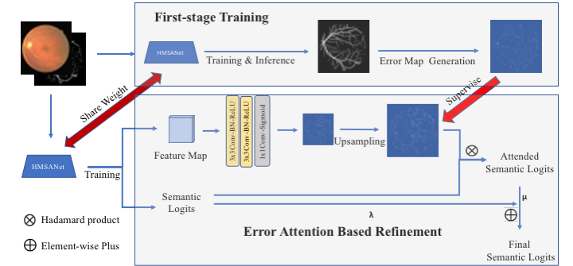

# EAR-NET: Error Attention Refining Network ForRetinal Vessel Segmentation

PyTorch implementation of 

[EAR-NET: Error Attention Refining Network ForRetinal Vessel Segmentation](https://arxiv.org/pdf/2107.01351.pdf)" ( DICTA 2021 ) 

If you use the code in this repo for your work, please cite the following bib entries:

    @article{wang2021ear,
        title={EAR-NET: Error Attention Refining Network For Retinal Vessel Segmentation},
        author={Wang, Jun and Yang, Zhao and Qian, Linglong and Yu, Xiaohan and Gao, Yongsheng},
        journal={arXiv preprint arXiv:2107.01351},
        eprint={2107.01351},
        archivePrefix={arXiv},
        primaryClass={cs.CV}
    }

## Abstract

The precise detection of blood vessels in retinal images is crucial to the early diagnosis of the retinal vascular diseases, e.g., diabetic, hypertensive and solar retinopathies. Existing works often fail in predicting the abnormal areas, e.g, sudden brighter and darker areas and are inclined to predict a pixel to background due to the significant class imbalance, leading to high accuracy and specificity while low sensitivity. To that end, we propose a novel error attention refining network (ERA-Net) that is capable of learning and predicting the potential false predictions in a two-stage manner for effective retinal vessel segmentation. The proposed ERA-Net in the refine stage drives the model to focus on and refine the segmentation errors produced in the initial training stage. To achieve this, unlike most previous attention approaches that run in an unsupervised manner, we introduce a novel error attention mechanism which considers the differences between the ground truth and the initial segmentation masks as the ground truth to supervise the attention map learning. Experimental results demonstrate that our method achieves state-of-the-art performance on two common retinal blood vessel datasets.

## Prerequisites

The following packages are required to run the scripts:
- [Python >= 3.6]
- [PyTorch >= 1.0]
- [Torchvision]
For more required packages and instruction, please follow the instruction of [Nvidia/semantic-segmentation](https://github.com/NVIDIA/semantic-segmentation).

## Dataset
Please refer to the [SA-UNet](https://github.com/clguo/SA-UNet) to prepare and enrich the datasets.
The dataset also can be downloaded from [Google Drive](https://drive.google.com/drive/folders/1EF_iamMlnb0QYS2xiQRq--fxm7an4tv7?usp=sharing).
Error maps from first-phase model also can be downloaded from above link. 
Alternatively, you can train the first-phase model from scratch and then generate the error maps by yourselves.

## Training scripts for EARNet on STARE dataset.
Train the model on the STARE dataset. We run our experiments on 4x2080Ti/4x1080Ti.

    $ python -m runx.runx scripts/train_stare.yml -i
In this first-stage training, set the "arch" parameter to "ocrnet.HRNet_Mscale", and to "ocrnet_error_attn.HRNet_Mscale" in the second-stage refinement.

## Testing scripts for EARNet on STARE dataset.
Test the model on the Soybean dataset:

    $ python -m runx.runx scripts/eval_stare.yml -i
    
        
            
## Download  Models

[Trained model Google Drive](https://drive.google.com/drive/folders/11SA7PGR9NbyJEaXFOHwA_PGiORdIEoYZ?usp=sharing)

## Acknowledgment
Thanks for the advice and guidance given by Dr.Xiaohan Yu and Prof. Yongsheng Gao.
Our project references the codes in the following repos.
- [Nvidia/semantic-segmentation](https://github.com/NVIDIA/semantic-segmentation)
